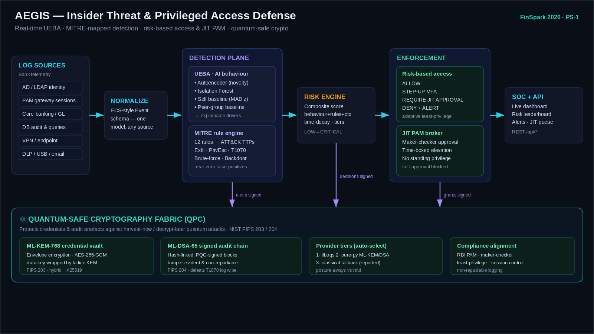

# AEGIS — Architecture

AEGIS is a layered detection-and-response pipeline. Telemetry from every
privileged-access surface is normalized into a single event model, scored in
parallel by an AI behavioural engine and a MITRE-mapped rule engine, fused into
a decaying composite risk score, and turned into a real-time access decision.
Every security-relevant action is sealed into a quantum-signed audit chain, and
privileged credentials live in a quantum-safe vault.

## Design principles

The platform is built around five ideas. First, **normalize early**: all
sources collapse into one `Event` schema so detection is source-agnostic and
new log feeds are additive. Second, **fuse ML with rules**: the autoencoder and
Isolation Forest catch unknown-unknowns while deterministic ATT&CK rules catch
known-bad TTPs with near-zero false positives — neither alone is sufficient in a
bank. Third, **risk is a moving signal, not a verdict**: scores decay over time
and drive adaptive authentication, so the same action is allowed for a trusted
user and challenged or blocked for a risky one. Fourth, **least privilege is
dynamic**: standing admin rights are replaced by time-boxed, maker-checker JIT
elevation. Fifth, **assume a quantum adversary**: anything worth stealing (keys,
credentials, audit logs) is protected with post-quantum cryptography today.

## Data model (`core/schema.py`)

The `Event` is an ECS-inspired record carrying actor, action type, host, geo,
success, privileged-session flag, data-movement volume, target resource,
command, and change-ticket reference. Seventeen `EventType`s span the insider
kill chain from `LOGIN` through `FILE_COPY_USB`, `PRIV_ESCALATION_ATTEMPT`, and
`LOG_DELETE`. A per-action `ACTION_SENSITIVITY` weight feeds both the risk and
access engines. Entities (`User`) carry role, privilege level (0–5), MFA
posture, employment status, watchlist flag, and usual-host list. The whole core
uses stdlib dataclasses so the detection engine has zero heavy dependencies.

## Ingestion & data (`data/`)

`generator.py` is a deterministic, seeded simulator that builds a realistic
banking workforce (tellers, branch managers, DBAs, sysadmins, network admins,
auditors, treasury ops, HR, and vendor contractors) and emits business-hours
activity whose shape differs per role and per individual, giving the UEBA
baselines real structure to learn. Five injectable scenarios reproduce classic
insider patterns: mass data exfiltration, privilege escalation with backdoor
creation, credential compromise with impossible travel, audit-log tampering,
and a dormant-then-burst contractor. `cert_loader.py` maps the CMU **CERT r4.2**
insider-threat corpus (logon/device/file/http/email CSVs plus the labeled
answers) onto the same `Event` model, so the identical pipeline runs on real
logged data.

## Behavioural analytics — UEBA (`analytics/`)

Events for each (user, time-window) are aggregated into a 16-dimension feature
vector spanning volume, timing (after-hours / weekend), authentication friction,
data egress, privileged-action counts, unticketed-change ratio, access breadth
(distinct hosts, non-home geo), and a sensitivity-weighted action load. Four
detectors score each window and are fused transparently:

- an **autoencoder** (compact NumPy MLP trained by back-prop on normal windows)
  flags behaviour it cannot reconstruct — the core novelty signal;
- an **Isolation Forest** (scikit-learn when present, else a self-contained
  NumPy implementation) flags statistical outliers;
- a **robust self-baseline** (median/MAD) captures "unlike this user's own
  history", resistant to the very outliers being hunted;
- a **peer-group baseline** captures "unlike others in this role", covering the
  cold-start case of a user with little personal history.

Both ML detectors are **calibrated against the training distribution** so a
typical normal window scores near 0 and a rare one near 1, regardless of
backend. The engine emits a 0–100 behaviour score plus human-readable drivers
("log max records: first-seen / far above own baseline"). On the bundled demo
data, normal activity sits at a 90th-percentile of ~32 while the injected
attacks score 54–72 from behaviour alone.

## Detection rules (`detection/`)

Twelve deterministic rules map to MITRE ATT&CK (Enterprise) techniques:
impossible-travel login (T1078), brute force (T1110), bulk USB exfiltration
(T1052.001), web-service exfiltration (T1567), privilege escalation (T1548),
backdoor account creation (T1136), audit-log tampering (T1070), defense
impairment (T1562), off-hours privileged activity, bulk DB extraction (T1213),
terminated/notice-period access, and privileged use from an unrecognized host
(T1021). Each fired rule emits an `Alert` with severity, the ATT&CK
tactic/technique, and structured evidence, and the engine exposes a coverage
report for the SOC.

## Risk engine (`risk/`)

The composite score blends behaviour (weight 0.40), severity-weighted rule hits
(0.45), and static identity context (0.15 — privilege level, MFA, watchlist,
employment status). Risk is **stateful and decays** with a configurable
half-life (default 6h): a spike jumps immediately (the score is the max of the
decayed prior and the fresh instantaneous value) and then cools unless
reinforced. Scores map to LOW / ELEVATED / HIGH / CRITICAL tiers. On the demo,
attackers surface at 69–79 (HIGH) while every normal user stays under 20 — clean
separation.

## Enforcement — risk-based access & PAM (`pam/`)

`AccessPolicy` maps (live risk × action sensitivity × identity) to one of
ALLOW, STEP-UP MFA, REQUIRE JIT APPROVAL, or DENY-AND-ALERT. Sensitive actions
raise the *effective* risk of a request, so the bar to perform them scales with
how damaging they would be, and missing MFA on a sensitive action always forces
a step-up. `JITBroker` replaces standing privilege with just-in-time elevation:
low-risk routine requests are auto-approved and time-boxed, while higher-risk
requests require a **maker-checker** second approver (the requester cannot
self-approve), with TTL expiry and full audit logging.

## Cryptographic posture (`crypto/`)

The `PQCProvider` presents one KEM + signature interface over a three-tier
backend and **always reports its true security posture**. Tier 1 is
[liboqs](https://openquantumsafe.org/) (production ML-KEM-768 / ML-DSA-65),
auto-preferred when installed. Tier 2 is the pure-python
[`kyber-py`](https://pypi.org/project/kyber-py/) (FIPS 203) and
[`dilithium-py`](https://pypi.org/project/dilithium-py/) (FIPS 204). Tier 3 is a
classical X25519 + Ed25519 fallback via `cryptography`, clearly reported as
**not** quantum-safe. When a PQC KEM is active, AEGIS runs it in **hybrid** mode
alongside an X25519 exchange (per NIST/IETF hybrid guidance) so a break of
either primitive alone does not expose the wrapped key.

Two subsystems consume it. The **credential vault** (`vault.py`) seals each
privileged secret with AES-256-GCM whose data key is wrapped by the PQC KEM
(envelope encryption); the plaintext key is never stored, so exfiltrating the
vault file yields nothing without the PQC decapsulation key — and the wrapped
key resists harvest-now/decrypt-later. The **audit chain** (`audit_chain.py`)
appends each action as a SHA-256 hash-linked block signed with ML-DSA, so any
retroactive edit or deletion breaks every subsequent link *and* fails signature
verification — directly defeating the insider "cover your tracks" tactic
(T1070) and satisfying non-repudiable-logging requirements.

> **Production note.** The pure-python PQC libraries are reference
> implementations and are not side-channel hardened; they are perfect for a
> prototype and for CI. For production, install the `oqs` extra so AEGIS routes
> through the audited liboqs implementation (it auto-detects and prefers it),
> and back the vault master key and audit-signing key with an HSM/KMS.

## Service & orchestration (`platform.py`, `api/`)

`AegisPlatform` wires the subsystems into one `ingest → detect → score → decide
→ audit` flow and holds the live SOC state. `api/server.py` exposes it over a
FastAPI REST API and serves a self-contained SOC dashboard
(`api/dashboard.py`) with a risk leaderboard, live alert feed, JIT approval
queue, MITRE coverage, quantum posture, and one-click scenario injection.

## Compliance alignment

The design maps directly onto RBI cyber-security-framework expectations for
banks: privileged-access management with session context, least-privilege via
JIT, maker-checker controls, periodic/every-time access evaluation, and
non-repudiable logging of privileged activity — with post-quantum protection as
a forward-looking differentiator.
